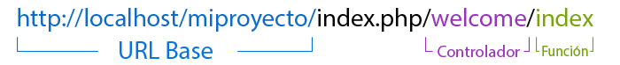

# Codeigniter en VenenuX Debian (RESUMIDO)

CodeIgniter son herramientas php para no re codificar, Ejemplo: 
si siempre trabajas con mysql, bueno codeigniter la tiene ya iniciada 
y solo envias los querys/consultas ahorrando tiempo al no codificar la conexcion.

* [Forma de trabajo: MVC](#forma-de-trabajo--mvc)
* [Instalacion](#instalacion)
* [Usando Codeigniter y Geany](#usando-codeigniter-y-geany)
* [Entendiendo a codeigniter para codificar](#entendiendo-a-codeigniter-para-codificar)
* [Resumen](#resumen)

## Forma de trabajo: MVC o normal

Codeigniter es famoso porque emplea MVC pero no lo obliga, 
es decir, **no es estricto** lo que hace facil para nosotros los novatos:

1. **M** de **Modelo** (Model), en el modelo codificas como obtienes 
datos desde la base de datos, aqui es donde haces los "querys" a la base 
de datos, y obtienes los resultados para manipularlos.
2. **V** de **Vista** (View), en este codificas el como vas presentar 
los datos despues de haberlos manipulados
3. **C** de **Controlador** (Controller), este es el que une todo, 
las acciones enviadas desde la vista, el las coordina con el modelo, 
el modelo le da los datos al controlador y este lo da a la vista.

## Instalacion

Trabaja es para PHP y para desarrollar necesitamso herramientas y programas, 
como adicional si tiene maquinas viejas es mejor usar estas dos opciones:

* Debian 7 LAMP: Maquinas 2006 al 2012 muy viejas -> https://sourceforge.net/projects/vegnuli/files/VenenuX-1.0/venenux-1.0-osposweb/debian-7-venenux-i386-20190531-snap.iso/download
* Debian 8 LAMP: Maquinas desde 2010 hasta 2015 -> https://sourceforge.net/projects/vegnuli/files/VenenuX-1.0/venenux-1.0-osposweb/debian-8-venenux-i386-20190531-snap.iso/download
* Debian actuales: seguir el instructivo:

#### 1 - INSTALACION LAMP (Debian 9 y superiores)

Abrir una consola, y ejecutar "su" para cambiar al usuario root, 
recuerde que no usamos winbuntu, en esos casos es "sudo":


Una vez como root ejecutar los siguientes comandos, cada secuencia o comando 
que debe ejecutar esta separado por una linea de espacio:

```
cat > /etc/apt/apt.conf.d/50venenuxcustom << EOF
APT::Get::AllowUnauthenticated "true";
Acquire::AllowInsecureRepositories "true";
Acquire::AllowDowngradeToInsecureRepositories "true";
Acquire::Check-Valid-Until "false";
EOF

apt-get update

apt-get -y --force-yes install mariadb-server mariadb-client

apt-get -y --force-yes install lighttpd spawn-fcgi apache2-utils

apt-get -y --force-yes install php php-common php-cgi php-fpm php-cli \
  php-curl php-mbstring php-mysql php-bcmath php-xml php-xmlrpc
```

Despues de un rato de descargar, segun la version de Debian 
habra instalado el software de programas LAMP (lighttp, Mysql y PHP), 
ahora hay que integrar sus configuraciones al servidor web, 
ejecutando los siguientes comandos separados cada uno por una linea vacia:

```
sed -i 's/bind-address.*=.*/bind-address=127.0.0.1/g' /etc/mysql/mysql.conf.d/mysqld.cnf

/usr/sbin/service  mysql restart

/usr/sbin/lighty-enable-mod accesslog fastcgi-php dir-listing status userdir usertrack

sed -i -r 's|userdir.path.*=.*|userdir.path = "Devel"|g' /etc/lighttpd/conf-available/10-userdir.conf

for i in $(ls /home);do mkdir -p -m 777 /home/$i/Devel ;done

echo "<?php echo phpinfo();" > /var/www/html/infophp.php

rm  /var/www/html/index.lighttpd.html

/usr/sbin/service lighttpd restart

```

Esto configura el webserver nuestro directorio de documentos, el directorio "Devel" 
pueda contener archivos de servicio web y php sin tener que ser root:


Probamos el servidor web y nuestro directorio colocando una tilde en la direccion del nombre de usuario, 
por ejemplo el `/home/usuario/Devel` sera en el navegador `http://127.0.0.1/~usuario/` asi:


#### 2 - INSTALACION HERRAMIENTAS Y CODEIGNITER

Ya tenemos en equivalente a entorno LAMP (web server y php con mysql), 
ahora necesitamos el editor de texto para codigo fuente y 
el gestor de cambios y control de versiones:

Abrir una consola, y ejecutar "su" para cambiar al usuario root, 
recuerde que no usamos winbuntu, en esos casos es "sudo":


Como root ejecutar los siguientes comandos, cada secuencia o comando 
que debe ejecutar esta separado por una linea de espacio:

```
apt-get --ignore-missing -y install geany geany-plugins giggle git meld  mysql-workbench
```

**NOTA** Si el comando resulto en error que no existe el paquete "mysql-workbench" 
repita pero borrando "myql-workbench", sucede solo en Debian 10, para este 
descargar de la pagina web de oracle el de ubuntu 18 e instalar 
en el Debian 10 con `dpkg -i mysql-workbench*.deb` desde el directorio donde se 
descargo.

Despues de instalar tendra listo para ejecutar desde el menu "Desarrolo" :


El framework en realidad es un conjunto de archvos php, que se copiaran 
a su proyecto y seran como la base en el cual se trabajara.

**IMPORTANTE** NO EJECUTAR ESTOS PASOS COMO ROOT SINO COMO USUARIO NORMAL su usuario.

1. Abrir una consola de linux normal
2. cambiarse al directorio "Devel" asi:
3. Descargar el codeigniter en Devel asi:
4. Descargar GroceryCrud para no hacer vistas de reportes de datos de tablas
5. Crear un directorio para su nuevo proyecto
6. Descomprimir el codeigniter para la base de su proyecto y groserycrud

Para cada uno de estos pasos ejecute los siguientes comandos despues de abrir 
la consola de linux como usuario normal, cada uno separado por una linea vacia:

```
cd ~/Devel

wget https://github.com/bcit-ci/CodeIgniter/archive/3.1.11.tar.gz -O CI3.tar.gz

wget https://github.com/scoumbourdis/grocery-crud/archive/v1.6.3.tar.gz -O CI3-GC-v1.6.3.tar.gz

mkdir ~/Devel/projectphp1

cd ~/Devel/projectphp1 && tar -xf ~/Devel/CI3.tar.gz --strip 1

cd ~/Devel/projectphp1 && tar -xf ~/Devel/CI3-GC-v1.6.3.tar.gz --strip 1
```


El proyecto estara ya listo para empezar codificar, 
(la siguiente seccion enseña como), **se puede verificar en el navegador, 
usando la ruta:**


## Usando Codeigniter y Geany

El IDE geany nos da todo lo necesario incluso navegacion web, no necesitamos 
de un navegador pesadisimo como firefox o chrome, para esto debemos configurar 
los dos plugins mas importantes: "treebrowser" y "webhelper".

El geany tiene tres regiones principales, tambien movibles aunque 
inicialmente viene asi:

1. Area de codificacion, es el area principal superior y a la derecha.
2. Area de archivos, es el area secundario, superior y a la iquierda.
3. Area de mensajes y web, es el area de multiusos, en el inferior.

Despues debemos configurar en el codigo Codeigniter nuestro proyecto, y ver 
como se ven nuestros cambios en el IDE geany.


Habilitar el plugin de "treebrowser" para ver archivos del proyecto en contexto:

1. Abrimos el editor geany desde el menu, 
2. En la barra superior, en "Herramientas" abrimos el apartado "Administracion de complementos", 
3. Navegamos hacia el final y vemos el complemento "Visor de arbol"
4. Activamos la casilla y vemos que aparece al lado una nueva pestaña

En esa pestaña nueva es que estableceremos el directorio "Devel", foto:


Abrimos el proyecto desde el area de archivos

* 1 - Para ver el arbol de proyecto debemos navegar entre las pestañas, 
estas aparecen con flechas hacia los lados para activar 
cada pestaña necesitada, la que se necesita es la de "Visor de arbol"
* 2 - Puede introducir la ruta de su directorio donde esta el proyecto 
en la direccion directamente en donde esta ubicado los archivos.
* 3 - Al ubicar el proyecto se pueen navegar los archivos para ubicar 
el directorio `Application/config` que es el primero en revisar 
en un proyecto CI, y estos son los archivos a comenzar modificar:


* **config.php** Configuracion general en `application/config/config.php`, 
en este archivo hay que asegurar los siguientes parametros:
   * **base_url** es bueno etablecer una autodeteccion , asi que aqui 
   configuraremos para que se establezca automatico con este codigo:
   `((isset($_SERVER['HTTPS']) && $_SERVER['HTTPS'] == 'on') ? 'https' : 'http').'://'.$_SERVER['HTTP_HOST'].str_replace(basename($_SERVER['SCRIPT_NAME']), '', $_SERVER['SCRIPT_NAME']);`
   sustituyendo en el espacio donde coloca `'';`.
   * **index_page** asegurarse que este establecido en `'index.php';` 
   ya que es la manera mas compatible entre varios servidores web.
   * **log_threshold** este parametro permite generar un archivo 
   de actividad llamaod "archivo log" y para eso hay que colocarlo 
   en el valor numerico de `4;` sin comillas simples (esta en cero).
   * **log_file_permissions** colocarlo en `666;` asi archivo de log 
   que se generara para que tanto el usuario como el servidor web 
   puedan leer y generarse.
   * **encryption_key** debe colocar una frase aleatoria o sin legibilidad, 
   sin secuencia alguna de letras y numeros de exactamente 32 digitos 
   es decir tiene que tener 32 letras o 32 digitos de numeros o combinacion 
   de ambos, por ejemplo `'1234567890asdfghjklñ1234567890as';` claro 
   que este ejemplo es muy simple, use mas creatividad.
* **routes.php** Enrutamiento de visitas web en `application/config/routes.php` 
aqui se define las rutas que se "llaman" en el navegador:
   * **default_controller** aqui al instalar CI esta en `'welcome'` y 
   es el nombre del archivo php controller que manejara si no se especifica 
   ninguna llamada web hacia el proyecto cuando se visite.
* **autoload.php** este permite cargar automaticamente ciertos 
sistemas ya codificados en el DI framework, y el mas comun es 
la libreria de base de datos o ayudantes para sustitucion de codigo:
   * **heper** aqui se pueden carga tre de mucha utilidad, que son 
   el de formularios, el de url y el de html, ayudan a no escribir 
   pedazos de codigo repetitivos, se establecen a el valor: 
   `array('form', 'url', 'html');` para cargar los tres.
   * **libraries** aqui se debe colocar que tipo de carga 
   y logica desea se carge, la principal es la de base de datos, 
   y otra importante es la de tablas html, se cargan asi:
   `array('database', 'table');`
* 4 - al terminar de configurar ya podra "probar" su proyecto en el mismo 
servidor web acabado de instalar, como "127.0.0.1" en el navegador tal cual 
se mostro en las imagenes anteriores, sin necesidad de ser root.

Abriremos el mysqlworkbench para poder crear la base de datos que 
usaremos.

1. En el menu superio seleccionar el de "Database", porque no viene en español.
2. Despues seleccionar el elemento "Manage Connections" para crear la conexcion.
3. Al abrirse el cuadro de dialogo pulsar el boton "new" abajo en la esquina.
4. Colocar el nombre por ejemplo "localhost" arriba
5. Seleccionar "local pipe/Socket" en el tipo de conexcion debajo del nombre.
6. En el ruta/host colocar "/var/run/mysql/mysql.sock" para casi todos los debian.
7. colocar el nombre de usuario, generalmente root ya que es local en su maquina.


## Entendiendo a codeigniter para codificar

El funcionamiento es "yo pido en el navegador" -> "el servidor responde si el controlador existe", 
este "servidor responde" se le llama "response" y la peticion 
que realiza "yo pido en el navegador" se le llama "request", 
a este par se le denomina en desarrollo coo "peticon - respuesta" o 
mejor denominado "request - response" (mal llamado cliente servidor).

Codeigniter maneja estas peticiones en los "controller" que estan 
en `applications/controller/` cada archivo es un controllador unico, 
y cada controlador es uan peticion, entonces

* tenemos un controlador "welcome" en `appliactions/controller/welcome.php`
* en el navegador para llamarlo se usa `http://127.0.0.1/~general/projectphp1/index.php/welcome/`
* en eso la url base es `http://127.0.0.1/~general/projectphp1/`
* y el controlador es el depeus de "index.php" asi:



Para tener una nueva url de "request" en el proyecto hay que:

1. crear una clase nueva en controller 
2. la clase se llame igual que el archivo php nuevo
3. la **primera letra mayuscula, ojo**, 
4. y en este debe existir un metodo "index" siempre.
5. en el metodo index se puede simplemente escribir un "echo"
6. vemos en el navegador agregando despues de "index.php" `/nuevocontrol/`

entonces asumamos el archivo es "nuevocontrol.php" con este 
codigo:

```
<?php
class Nuevocontrol extends CI_Controller 
{
	public function index()
	{
		echo "Este es el nuevo conroller, nuevocontrol";
	}
}
```
Cada uno de los seis pasos anteriores se puede ver en la ilustacion:


## RESUMEN

En este documento realizamos las siguientes actividades:

1. Instalamos los programs para servir como servidor web de desarrollo 
en la misma maquina que desarrollaremos.
2. Los programas de servidor fueron `lighttpd` como servidor web, 
y `mariadb` como servidor de base de datos, adicinalmente se instalo 
el entorno `php` ya que CI funciona es para php.
3. Instalamos los programas para herramientas en la maquina de desarrollo 
para codificar que se muestra en el siguiente documento.
4. Las herramientas de desarrollo para codificar son `geany` 
como editor de texto, `mysql-workbench` como administrador de la 
base de datos, y `git` como gestor de control de versiones.
5. Configuramos el editor IDE `geany` para tener el proyecto abierto, 
navegar en sus archivos, y previsualizar sin usar navegador web.
6. Descargamos los archvos de Codeigniter para trabajar en un proyecto nuevo, 
y le agregamos el GreceryCrud que permite trabajar datos.

# Vease tambien

* [README.md](README.md)
