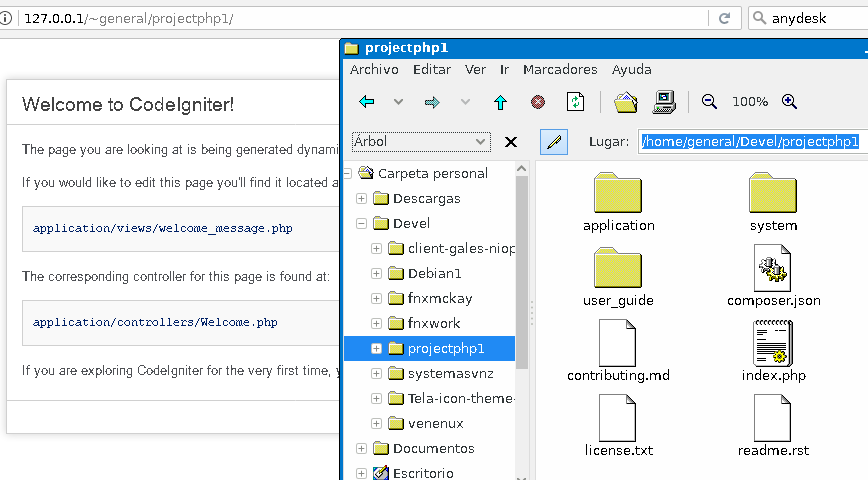
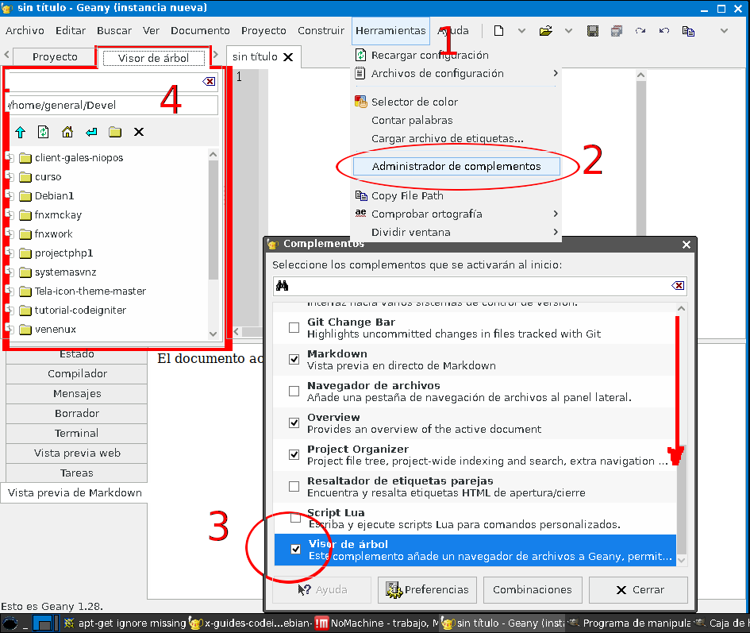
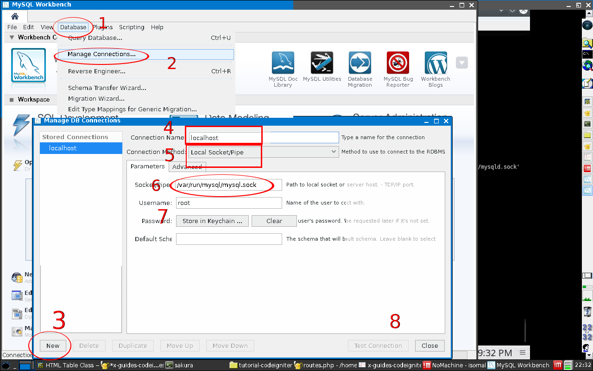

[](https://venenux.github.io/tutorial-codeigniter/)
[](contributing.md) 


# Codeigniter en VenenuX Debian

* [Forma de trabajo: MVC](#forma-de-trabajo--mvc)
* [Instalacion y Requerimientos](#instalacion-y-requerimientos)
* [Usando Codeigniter y Geany](#usando-codeigniter-y-geany)
* [Entendiendo a codeigniter](#entendiendo-a-codeigniter)
* [Resumen](#resumen)

## Explicacion

CodeIgniter es un framework, combo de herramientas que automatiza 
partes comunes en todo proyecto.

Ejemplo: si siempre trabajas con mysql, bueno codeigniter tiene ya iniciada 
y solo envias los querys/consultas ahorrando tiempo al no codificar la conexcion.

## Forma de trabajo: MVC

Codeigniter es famoso porque emplea MVC pero a este le permite
que sean un codigo realizable:

1. **M** de **Modelo** (Model), en el modelo codificas como obtienes 
datos desde la base de datos, aqui es donde haces los "querys" a la base 
de datos, y obtienes los resultados para manipularlos.
2. **V** de **Vista** (View), en este codificas el como vas presentar 
los datos despues de haberlos manipulados
3. **C** de **Controlador** (Controller), este es el que une todo, 
las acciones enviadas desde la vista, el las coordina con el modelo, 
el modelo le da los datos al controlador y este lo da a la vista.

**NOTA** lo expuesto aqui es para novatos.

## Instalacion y Requerimientos

Codeigniter o CI es para PHP, CI 2 y 3 trabajan con php 5 (5.3 a 5.6) y php7 ( al 7.3)
mientras que el CI 4 trabaja solo con php 7 unicamente.

Para desarrollar necesitamso herramientas y programas:

* Herramientas:
  * Editor IDE
  * Control versiones
  * codeigniter
  * grocerycrud
* Programas:
  * webserver con php
  * base de datos

Hay dos maneras.. la facil y rapida descargar venenux 
que ya tiene incluido todos los programas:

Maquinas desde 2012 hasta 2017 -> https://sourceforge.net/projects/vegnuli/files/VenenuX-1.0/venenux-1.0-osposweb/debian-8-venenux-i386-20190531-snap.iso/download
Maquinas 2006 al 2012 muy viejas -> https://sourceforge.net/projects/vegnuli/files/VenenuX-1.0/venenux-1.0-osposweb/debian-7-venenux-i386-20190531-snap.iso/download

La otra manera si no gusta esto es instalacion manual:

#### 1 - Instalacion entorno:

Se asume tiene un sistema Debian instalado, necesitara instalar el servicio 
Web (apache o lighttpd), el engine Php (php5 o php7), la base de datos (Mysql), 
el editor IDE (geany) y el control de versiones (git). 

Adicional a esto, tambien un administrador de base de daatos (mysqlworkbench), 
un comparador de archivos (meld), un navegador web para ver el proyecto (chrome), 
y un gestor de archivos para el ftp o ssh (caja o pcmanfm).


***Primero instalar el servidor de base de datos:***

1 - abrir una consola, y ejecutar "su" para cambiar al usuario root, 
recuerde que no usamos winbuntu, en esos casos es "sudo":


2 - Como root ejecutar los siguientes comandos, cada secuencia o comando 
que debe ejecutar esta separado por una linea de espacio:

```
apt-get remove --purge --force-all mariadb* mysql*

cat > /etc/apt/apt.conf.d/50venenuxcustom << EOF
APT::Get::AllowUnauthenticated "true";
Acquire::AllowInsecureRepositories "true";
Acquire::AllowDowngradeToInsecureRepositories "true";
Acquire::Check-Valid-Until "false";
EOF

cat > /etc/apt/sources.list.d/51-mysql.list << EOF
deb http://repo.mysql.com/apt/debian/ $(lsb_release -s -c) mysql-5.6
deb http://repo.mysql.com/apt/debian/ $(lsb_release -s -c) mysql-5.7
deb http://repo.mysql.com/apt/debian/ $(lsb_release -s -c) mysql-tools
EOF

apt-get update

apt-get -y --force-yes install mysql-server mysql-client mysql-common mysql-community-server libmysqlclient20
```

3 - Despues de un rato de descargar, segun la version de Debian 
este va preguntar o no por la calve de root, y 
como es para desarrollo no es necesario configurar mas:

```
ski0="";ski0=$(grep skip-name-re /etc/mysql/mysql.conf.d/mysqld.cnf);[[ $ski0 != '' ]] && echo listo || sed -i -e 's|.*bind-address.*=.*|bind-address\t= 127.0.0.1\nskip-external-locking|g' /etc/mysql/mysql.conf.d/mysqld.cnf
ski1="";ski1=$(grep skip-name-re /etc/mysql/mysql.conf.d/mysqld.cnf);[[ $ski1 != '' ]] && echo listo || sed -i -e 's|skip-external-locking|skip-external-locking\nskip-name-resolve|g' /etc/mysql/mysql.conf.d/mysqld.cnf
ski2="";ski2=$(grep local-infile /etc/mysql/mysql.conf.d/mysqld.cnf);[[ $ski2 != '' ]] && echo listo || sed -i -e 's|skip-name-resolve|skip-name-resolve\nlocal-infile=0|g' /etc/mysql/mysql.conf.d/mysqld.cnf
ski3="";ski3=$(grep symbolic-lin /etc/mysql/mysql.conf.d/mysqld.cnf);[[ $ski3 != '' ]] && echo listo || sed -i -e 's|local-infile=0|local-infile=0\nsymbolic-links=0|g' /etc/mysql/mysql.conf.d/mysqld.cnf
sed -i 's/bind-address.*=.*/bind-address=127.0.0.1/g' /etc/mysql/mysql.conf.d/mysqld.cnf

cat > /etc/security/limits.d/50-mysql.conf << EOF
mysql soft nofile 65535
mysql hard nofile 65535
EOF

/usr/sbin/service  mysql restart
```

Esto permitira conectarnos localmente a nuestra base de datos.

4 - Para poder administrarla y gestionarla emplearemos un 
completo administrador local el "mysqlworkbench" el cual 
esta en todos los debian menos el 10, para este descargar 
de al pagina web de oracle el de ubuntu 18 el cual instalara perfecto.

En los debian desde wheezy hasta jessie, se puede instalar asi:

```
apt-get -y --force-yes install mysql-workbench
```

Despues de instalar tendra listo para ejecutar desde el menu "Desarrolo" :


***Segundo instalar el servidor web y php:***


1 - Igual una consola, y ejecutar "su" para cambiar al usuario root, 
recuerde que no usamos winbuntu, en esos casos es "sudo":


2 - Como root ejecutar los siguientes comandos, cada secuencia o comando 
que debe ejecutar esta separado por una linea de espacio:

```
apt-get -y install lighttpd spawn-fcgi apache2-utils

/usr/sbin/lighty-enable-mod cgi dir-listing accesslog fastcgi status userdir usertrack

/usr/sbin/service lighttpd restart

rm  /var/www/html/index.lighttpd.html
```

3 - Esto le permitira tener ya el servidor web listo para usar, 
para ver si sirve instalar el navegador web firefox 
y al abrir firefox navegar la ruta `http://127.0.0.1/` debera 
si ejecuto todo mostar un pequeño index:


4 - Ahora hay que instalar el engine php y los modulos php requeridos, 
para esto aun como root en la terminal ejecutar los comandos cada uno separado 
por una linea en blanco:

```
apt-get -y --force-yes install php php-common php-cgi php-fpm php-cli \
  php-curl php-readline php-gd php-gmp php-imap php-intl php-mbstring \
  php-mysql php-odbc php-pgsql php-sqlite3 php-sybase \
  php-recode php-snmp php-ssh2 php-bz2 php-bcmath php-enchant \
  php-xml php-xmlrpc php-pspell php-json \
  php-pear php-xml-dtd php-xml-parser php-xml-rpc2 \
  php-oauth php-apcu php-apcu-bc php-net-smtp php-gettext
```
**OPCIONAL - IMPORTANTE:** Si el comando anterior falla, es porque en los debian viejos, 
se llamaban distintos, eran php 5  y hoy dia se llaman php sin version, 
si usa debian viejo ejecute este comando como root obviamente:

```
apt-get -y install php5-common php5-gmp php5-readline php5-recode \
  php5-odbc php5-imap php5-sybase php5-sqlite php5-mysql \
  php5-xml* php5-xsl php5-pgsql php5-intl php5-enchant \
  php5-curl php5-mcrypt php5-gd php5-pspell php5-snmp \
  php5-cli php5-fpm php5-cgi php5 php5-http php5-apcu
```

5 - Una vez instalado php hay que activarlo en el servicio web, 
ejecute los siguientes comandos en la misma consola de root:

```
/usr/sbin/lighty-enable-mod accesslog cgi fastcgi fastcgi-php

echo "<?php echo phpinfo();" > /var/www/html/infophp.php

/usr/sbin/service lighttpd restart
```

Ahora para verificar que el engine php sirve en el servidor web, 
abrimos el firefox y visitamos la url `http://127.0.0.1/infophp.php` 
y nos deveria aparecer informacion de php:


6 - Para usar el directorio personal con php, activamos nuestro 
directorio personal de proyectos "Devel" en el mismo servidor web, 
en la misma consola de root ejecute los comandos separados por linea en blanco:

```
sed -i -r 's|userdir.path.*=.*|userdir.path = "Devel"|g' /etc/lighttpd/conf-available/10-userdir.conf

for i in $(ls /home);do mkdir -p -m 777 /home/$i/Devel ;done

mkdir -p /etc/skel/Devel

/usr/sbin/lighty-enable-mod  userdir usertrack

service lighttpd restart
```

Esto hara que en nuestro directorio de documentos, el directorio "Devel" 
pueda contener archivos de servicio web y php sin tener que se root, 
esto se verifica colocando una tilde en la direccion del nombre de usuario, 
por ejemplo el `/home/usuario/Devel` sera en navegador `http://127.0.0.1/~usuario/` asi:


***Tercero instalar editor IDE y git:***

Ya tenemos en equivalente a entorno LAMP (web server y php con mysql), 
ahora necesitamos el editor de texto para codigo fuente y 
el gestor de cambios y control de versiones:

1 - Igual una consola, y ejecutar "su" para cambiar al usuario root, 
recuerde que no usamos winbuntu, en esos casos es "sudo":


2 - Como root ejecutar los siguientes comandos, cada secuencia o comando 
que debe ejecutar esta separado por una linea de espacio:

```
apt-get -y install geany geany-plugins giggle git meld

```

3 - Esto colocara en el menu "Desarrollo" tres programas nuevos, 
el editor Geany, el cvs Giggle, y el diff Meld:


Ya con esto se tiene las herramientas ahora se necesita el framework:


#### 2 - Instalacion framework y proyecto nuevo:


El framework en realidad es un conjunto de archvos php, que se copiaran 
a su proyecto y seran como la base en el caul se trabajara.

Se puede usar descargando y descomprimiendo o usando git, 
sea como sean si con git o decargando de aqui en adelante 
no necesitara ejecutar comandos como usuario root:

1. - Abrir uan consola de linux y cambiarse al directorio "Devel" asi:
2. - Descargar el codeigniter en Devel asi:
5. - Descargar GroceryCrud para no hacer vistas de reportes de datos de tablas
3. - Crear un directorio para su nuevo proyecto
4. - Descomprimir el codeigniter para la base de su proyecto
6. - Dar permisos al servidor web para escribir en el aplicativo

```
cd ~/Devel

wget https://github.com/bcit-ci/CodeIgniter/archive/3.1.11.tar.gz -O CI3.tar.gz

wget https://github.com/scoumbourdis/grocery-crud/archive/v1.6.3.tar.gz -O CI3-GC-v1.6.3.tar.gz

mkdir ~/Devel/projectphp1

cd ~/Devel/projectphp1 && tar -xf ~/Devel/CI3.tar.gz --strip 1

cd ~/Devel/projectphp1 && tar -xf ~/Devel/CI3-GC-v1.6.3.tar.gz --strip 1

chmod 666 ~/Devel/projectphp1/application/log

chmod 666 ~/Devel/projectphp1/application/cache

chmod 666 ~/Devel/projectphp1/assets/uploads
```


El proyecto estara ya listo para empezar codificar, 
(la siguiente seccion enseña como), se puede verificar en el navegador, 
usando la ruta:



## Usando Codeigniter y Geany

El IDE geany nos da todo lo necesario incluso navegacion web, no necesitamos 
de un navegador pesadisimo como firefox o chrome, para esto debemos configurar 
los dos plugins mas importantes: "treebrowser" y "webhelper".

El geany tiene tres regiones principales, tambien movibles aunque 
inicialmente viene asi:

1. Area de codificacion, es el area principal superior y a la derecha.
2. Area de archivos, es el area secundario, superior y a la iquierda.
3. Area de mensajes y web, es el area de multiusos, en el inferior.

Despues debemos configurar en el codigo Codeigniter nuestro proyecto, y ver 
como se ven nuestros cambios en el IDE geany.


#### 1. Ajustando el entorno IDE geany

Habilitar el plugin de "treebrowser" para ver archivos del proyecto en contexto:

1. Abrimos el editor geany desde el menu, 
2. En la barra superior, en "Herramientas" abrimos el apartado "Administracion de complementos", 
3. Navegamos hacia el final y vemos el complemento "Visor de arbol"
4. Activamos la casilla y vemos que aparece al lado una nueva pestaña

En esa pestaña nueva es que estableceremos el directorio "Devel", foto:



Habilitar el plugin de "webhelper" para ver archivos del proyecto en contexto:

1. Abrimos el editor geany desde el menu, 
2. En la barra superior, en "Herramientas" abrimos el apartado "Administracion de complementos", 
3. Navegamos hacia el final y vemos el complemento "Ayudante Web"
4. Activamos la casilla y vemos que aparece al lado una nueva pestaña

Abajo aparece "Vista previa web" pero **esto ya no esta para debian 10 ni 11**:


#### 2. Abriendo y Ajustando el proyecto codeigniter

Abrimos el proyecto desde el area de archivos

* 1 - Para ver el arbol de proyecto debemos navegar entre las pestañas, 
estas aparecen con flechas hacia los lados para activar 
cada pestaña necesitada, la que se necesita es la de "Visor de arbol"
* 2 - Puede introducir la ruta de su directorio donde esta el proyecto 
en la direccion directamente en donde esta ubicado los archivos.
* 3 - Al ubicar el proyecto se pueen navegar los archivos para ubicar 
el directorio `Application/config` que es el primero en revisar 
en un proyecto CI, y estos son los archivos a comenzar modificar:


* **config.php** Configuracion general en `application/config/config.php`, 
en este archivo hay que asegurar los siguientes parametros:
   * **base_url** es bueno etablecer una autodeteccion , asi que aqui 
   configuraremos para que se establezca automatico con este codigo:
   `((isset($_SERVER['HTTPS']) && $_SERVER['HTTPS'] == 'on') ? 'https' : 'http').'://'.$_SERVER['HTTP_HOST'].str_replace(basename($_SERVER['SCRIPT_NAME']), '', $_SERVER['SCRIPT_NAME']);`
   sustituyendo en el espacio donde coloca `'';`.
   * **index_page** asegurarse que este establecido en `'index.php';` 
   ya que es la manera mas compatible entre varios servidores web.
   * **log_threshold** este parametro permite generar un archivo 
   de actividad llamaod "archivo log" y para eso hay que colocarlo 
   en el valor numerico de `4;` sin comillas simples (esta en cero).
   * **log_file_permissions** colocarlo en `666;` asi archivo de log 
   que se generara para que tanto el usuario como el servidor web 
   puedan leer y generarse.
   * **encryption_key** debe colocar una frase aleatoria o sin legibilidad, 
   sin secuencia alguna de letras y numeros de exactamente 32 digitos 
   es decir tiene que tener 32 letras o 32 digitos de numeros o combinacion 
   de ambos, por ejemplo `'1234567890asdfghjklñ1234567890as';` claro 
   que este ejemplo es muy simple, use mas creatividad.
* **routes.php** Enrutamiento de visitas web en `application/config/routes.php` 
aqui se define las rutas que se "llaman" en el navegador:
   * **default_controller** aqui al instalar CI esta en `'welcome'` y 
   es el nombre del archivo php controller que manejara si no se especifica 
   ninguna llamada web hacia el proyecto cuando se visite.
* **autoload.php** este permite cargar automaticamente ciertos 
sistemas ya codificados en el DI framework, y el mas comun es 
la libreria de base de datos o ayudantes para sustitucion de codigo:
   * **heper** aqui se pueden carga tre de mucha utilidad, que son 
   el de formularios, el de url y el de html, ayudan a no escribir 
   pedazos de codigo repetitivos, se establecen a el valor: 
   `array('form', 'url', 'html');` para cargar los tres.
   * **libraries** aqui se debe colocar que tipo de carga 
   y logica desea se carge, la principal es la de base de datos, 
   y otra importante es la de tablas html, se cargan asi:
   `array('database', 'table');`
* 4 - al terminar de configurar ya podra "probar" su proyecto en el mismo 
servidor web acabado de instalar, como "127.0.0.1" en el navegador tal cual 
se mostro en las imagenes anteriores, sin necesidad de ser root.

#### 3. Creando la base de datos visualmente

Abriremos el mysqlworkbench para poder crear la base de datos que 
usaremos.

1. En el menu superio seleccionar el de "Database", porque no viene en español.
2. Despues seleccionar el elemento "Manage Connections" para crear la conexcion.
3. Al abrirse el cuadro de dialogo pulsar el boton "new" abajo en la esquina.
4. Colocar el nombre por ejemplo "localhost" arriba
5. Seleccionar "local pipe/Socket" en el tipo de conexcion debajo del nombre.
6. En el ruta/host colocar "/var/run/mysql/mysql.sock" para casi todos los debian.
7. colocar el nombre de usuario, generalmente root ya que es local en su maquina.




#### 4. Entendiendo a codeigniter

El funcionamiento es "yo pido en el navegador" -> "el servidor responde si el controlador existe", 
este "servidor responde" se le llama "response" y la peticion 
que realiza "yo pido en el navegador" se le llama "request", 
a este par se le denomina en desarrollo coo "peticon - respuesta" o 
mejor denominado "request - response" (mal llamado cliente servidor).

Codeigniter maneja estas peticiones en los "controller" que estan 
en `applications/controller/` cada archivo es un controllador unico, 
y cada controlador es uan peticion, entonces

* tenemos un controlador "welcome" en `appliactions/controller/welcome.php`
* en el navegador para llamarlo se usa `http://127.0.0.1/~general/projectphp1/index.php/welcome/`
* en eso la url base es `http://127.0.0.1/~general/projectphp1/`
* y el controlador es el depeus de "index.php" asi:


## RESUMEN

En este documento realizamos las siguientes actividades:

1. Instalamos los programs para servir como servidor web de desarrollo 
en la misma maquina que desarrollaremos.
2. Los programas de servidor fueron `lighttpd` como servidor web, 
y `mariadb` como servidor de base de datos, adicinalmente se instalo 
el entorno `php` ya que CI funciona es para php.
3. Instalamos los programas para herramientas en la maquina de desarrollo 
para codificar que se muestra en el siguiente documento.
4. Las herramientas de desarrollo para codificar son `geany` 
como editor de texto, `mysql-workbench` como administrador de la 
base de datos, y `git` como gestor de control de versiones.
5. Configuramos el editor IDE `geany` para tener el proyecto abierto, 
navegar en sus archivos, y previsualizar sin usar navegador web.
6. Descargamos los archvos de Codeigniter para trabajar en un proyecto nuevo, 
y le agregamos el GreceryCrud que permite trabajar datos.

# Vease tambien

* [README.md](README.md)
